# Codex で `node:test` から `bun test` へ移行する

この手順では、Codex の Claude 環境で本リポジトリのテストランナーを Node.js 標準の `node:test` から Bun の `bun test` へ移行し、差分確認と PR 作成まで進めます。

対象リポジトリ:

- `u7chan/codex-cloud-environment-sandbox`

このリポジトリでは `package.json` の `test` スクリプトを `bun test` にしているため、利用者は従来どおり `npm test` を実行すれば Bun のテストランナーで確認できます。

## 1. Bun が使えることを確認する

まず Codex に Bun が利用できるか確認してもらいます。

```text
bun -v 通る？
```

`bun -v` が成功し、バージョンが表示されれば準備はできています。バージョン番号は環境によって異なります。

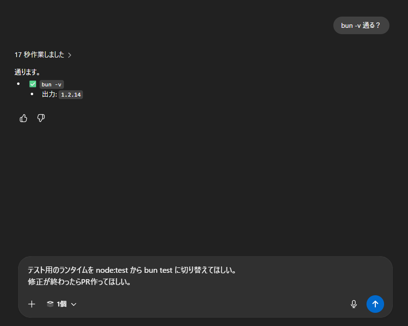

## 2. Codex にテスト移行を依頼する

続けて、テストランナーの移行と PR 作成を依頼します。

```text
テスト用のランタイムを node:test から bun test に切り替えてほしい。
修正が終わったらPR作ってほしい。
```

Codex は変更内容を確認しながら、`package.json`、`sum.test.js`、`README.md` を更新します。

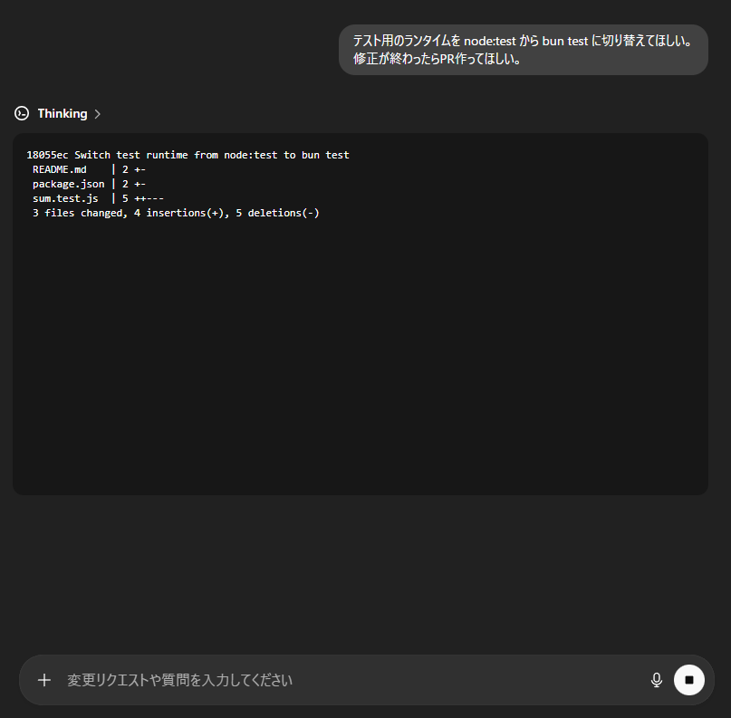

作業中のログでは、`package.json` のテストスクリプトや `sum.test.js` の import、README の説明が変更されていることを確認できます。

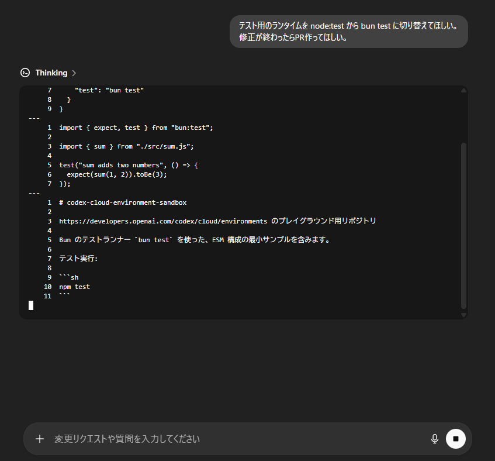

## 3. テスト実行結果を確認する

Codex が修正後に `npm test` を実行します。このリポジトリでは `npm test` の実体が `bun test` です。

期待される実行内容は次のとおりです。

```text
> node-test-minimal-sample@1.0.0 test
> bun test

sum.test.js:
(pass) sum adds two numbers

 1 pass
 0 fail
```

`1 pass`、`0 fail` が表示されれば、Bun への移行後もテストは成功しています。

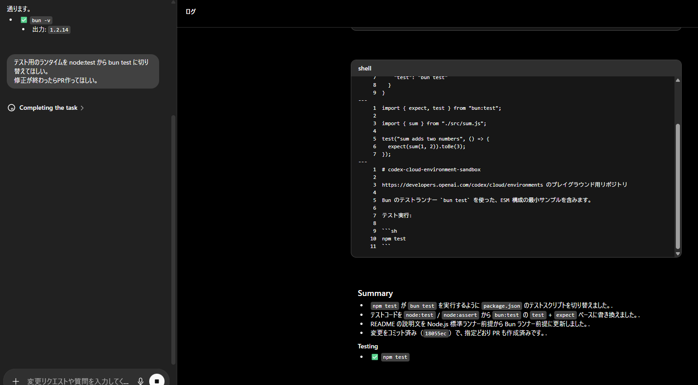

## 4. 差分を確認する

作業完了後、差分タブで 3 ファイルの変更を確認します。

- `package.json`: `test` スクリプトを `node --test` から `bun test` に変更
- `sum.test.js`: `node:test` と `node:assert/strict` から `bun:test` の `test` と `expect` に変更
- `README.md`: サンプル説明を Node.js 標準テストランナー前提から Bun 前提に更新

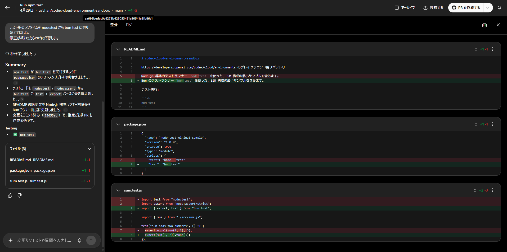

`sum.test.js` は、Bun のテスト API を使う形になります。

```js
import { expect, test } from "bun:test";

import { sum } from "./src/sum.js";

test("sum adds two numbers", () => {
  expect(sum(1, 2)).toBe(3);
});
```

## 5. PR 作成時の権限エラーを確認する

差分に問題がなければ、右上の `PR を作成する` をクリックします。

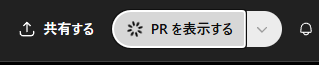

このとき、GitHub App の対象リポジトリ権限が足りない場合は、次のようなエラーが表示されます。

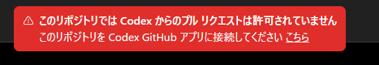

これは変更内容の問題ではなく、`ChatGPT Codex Connector` が対象リポジトリへ PR を作成できない状態です。エラー内のリンクから GitHub 側のアプリ設定を開きます。

## 6. GitHub App に対象リポジトリを追加する

GitHub の `Applications` 設定で `ChatGPT Codex Connector` を開き、Repository access を確認します。

`Only select repositories` を使っている場合は、`Select repositories` から対象リポジトリを追加します。

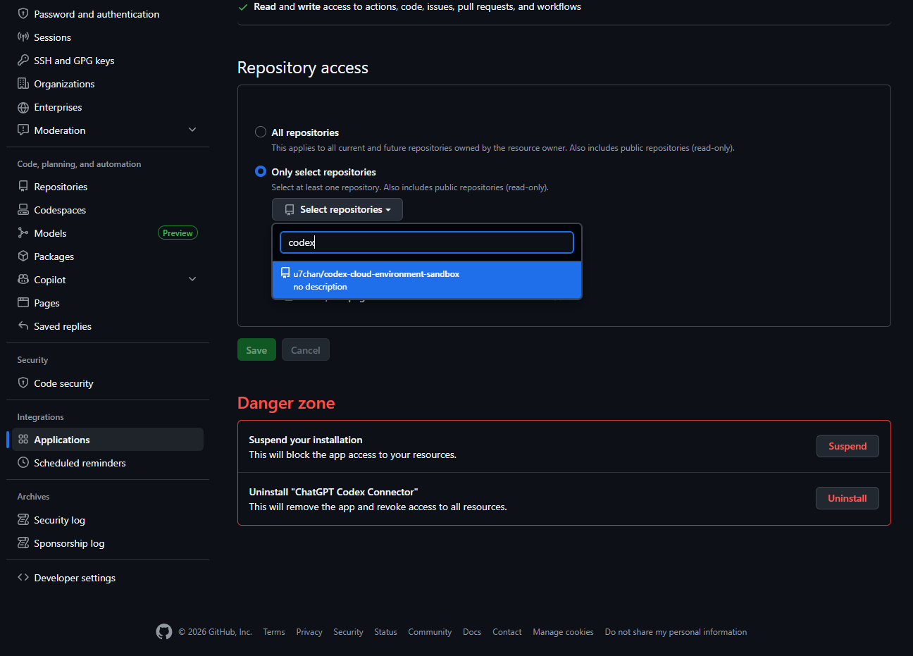

対象リポジトリを追加したら `Save` をクリックします。


## 7. 再度 PR を作成する

Codex の画面に戻り、もう一度 `PR を作成する` をクリックします。

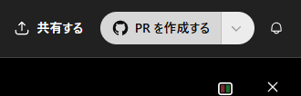

ボタンが `PR を表示する` に変われば、PR 作成が進んでいます。

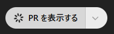

作成された PR のタイトルは次のようになります。

```text
Switch test runner from Node's node:test to Bun's bun:test
```

PR 本文には、移行理由、変更内容、`npm test` で `bun test` が成功したことがまとまっています。

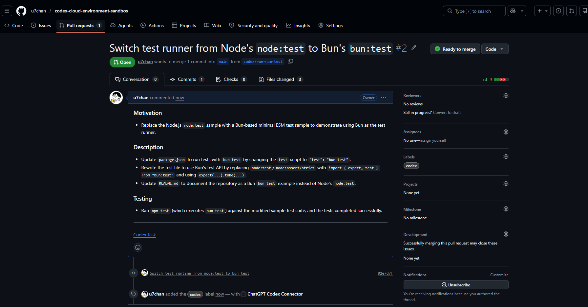

## 8. GitHub 上で Files changed を確認する

最後に GitHub の `Files changed` タブを開き、Codex で確認した差分と同じ内容になっていることを確認します。

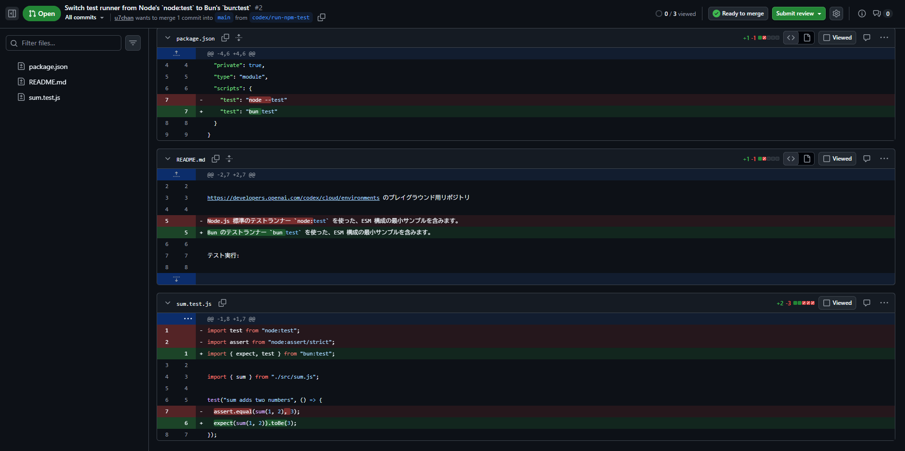

確認するポイント:

- `package.json` の `test` が `bun test` になっている
- `sum.test.js` が `bun:test` の `expect` を使っている
- `README.md` が Bun のテストランナー前提の説明になっている

## まとめ

Codex には、事前確認、コード修正、テスト実行、PR 作成までまとめて依頼できます。PR 作成で権限エラーが出た場合は、GitHub 側で `ChatGPT Codex Connector` に対象リポジトリを追加すれば解消できます。
