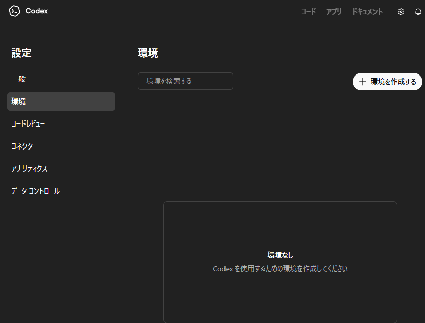
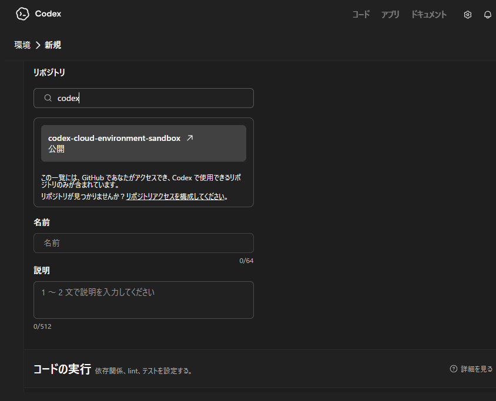
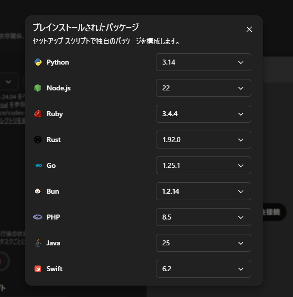
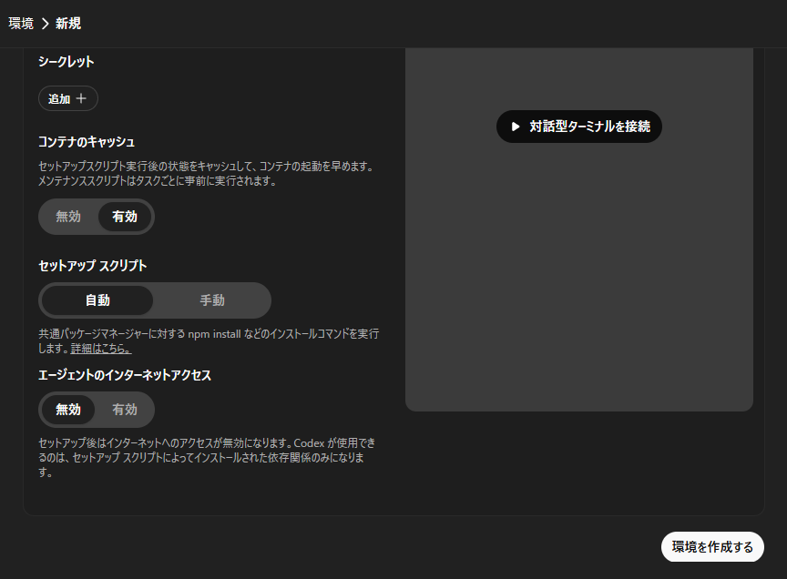
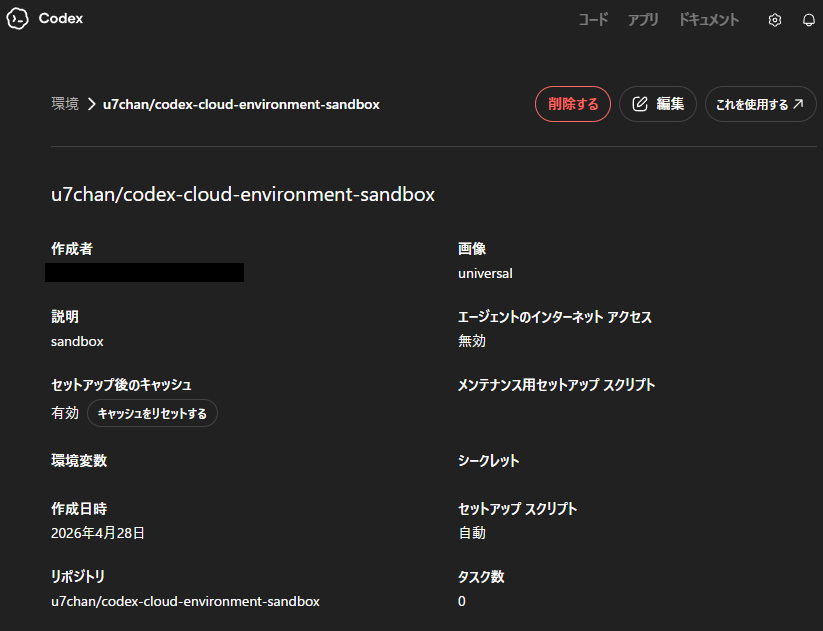
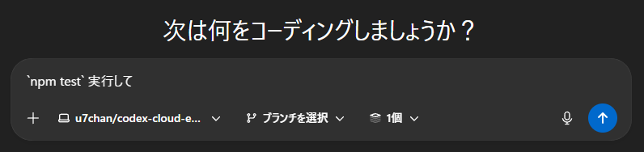
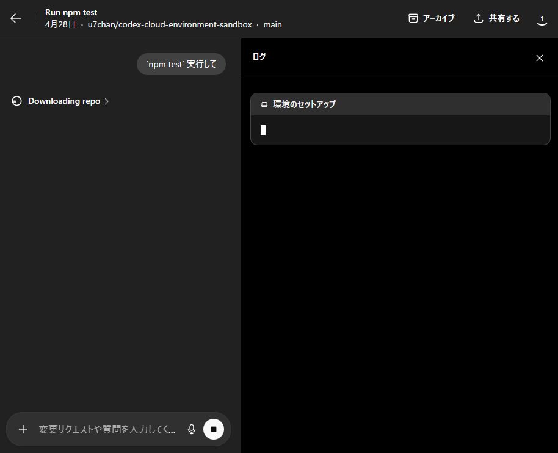
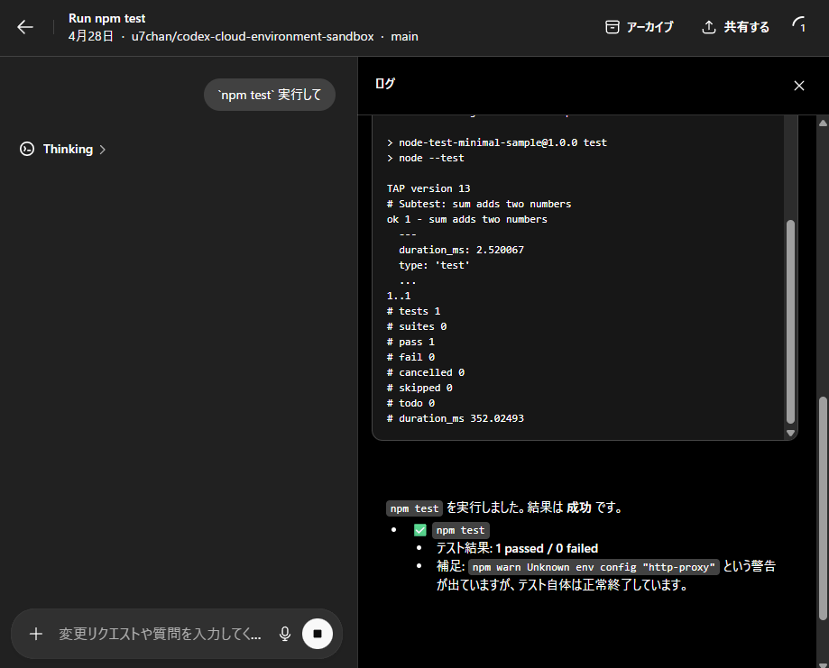

# Codex の Claude 環境でこのリポジトリをセットアップしてテストを実行する

この手順では、Codex の環境作成画面から本リポジトリ用の環境を新規作成し、`npm test` を実行してテスト成功まで確認します。

対象リポジトリ:

- `u7chan/codex-cloud-environment-sandbox`

このリポジトリは Node.js の最小サンプルで、テストは Node.js 標準の `node:test` を使っています。依存パッケージはないため、基本的には環境作成後すぐにテストを実行できます。

## 1. 環境一覧から新規作成を開く

Codex の設定画面で `環境` を開き、右上の `環境を作成する` をクリックします。



## 2. 対象リポジトリを選ぶ

リポジトリ検索欄で `codex-cloud-environment-sandbox` を検索し、対象リポジトリを選択します。

`名前` と `説明` は任意ですが、識別しやすい値を入れておくと分かりやすいです。

例:

- 名前: `u7chan/codex-cloud-environment-sandbox`
- 説明: `sandbox`



## 3. 実行言語として Node.js を確認する

`コードの実行` の設定で、Node.js が利用できることを確認します。スクリーンショットでは `Node.js 22` を選択しています。

このリポジトリは Node.js で動くため、特別な追加設定は不要です。



## 4. セットアップオプションを確認して環境を作成する

次の設定で問題ありません。

- `セットアップスクリプト`: `自動`
- `エージェントのインターネットアクセス`: `無効`
- `コンテナのキャッシュ`: 必要に応じて設定

設定を確認したら `環境を作成する` をクリックします。

このリポジトリには追加依存がないため、`自動` のままで十分です。



## 5. 作成した環境を開く

環境作成後、詳細画面が表示されます。内容を確認し、右上の `これを使用する` をクリックします。



## 6. Codex にテスト実行を依頼する

プロンプト入力欄で次のように入力します。

```text
npm test 実行して
```

送信すると、Codex がリポジトリ取得と環境セットアップを開始します。



## 7. セットアップと実行ログを確認する

最初は `Downloading repo` や `環境のセットアップ` が表示されます。これはリポジトリ取得と初期準備が進んでいる状態です。

少し待つと `npm test` の実行に進みます。



## 8. テスト成功を確認する

ログに `pass 1`、`fail 0` が表示されれば成功です。

このリポジトリで期待される実行結果の例:

```text
> node-test-minimal-sample@1.0.0 test
> node --test

✔ sum adds two numbers
```

スクリーンショットのように `1 passed / 0 failed` と表示されていれば、セットアップとテスト実行は完了です。

補足:

- `npm warn Unknown env config "http-proxy"` のような警告が出る場合があります。
- この警告が出ても、テスト本体が成功していれば今回の確認としては問題ありません。



## まとめ

Codex の環境作成画面から本リポジトリを選び、Node.js が利用できる設定のまま環境を作成し、`npm test` を実行すれば確認完了です。
